# Simple Java Socket HTTP

一个纯 Java Socket 实现的迷你 HTTP 服务器与客户端（含 Swing GUI 客户端），通过底层 Socket 通信完整模拟 HTTP 协议的核心功能。

## 项目概述

本项目是一个 HTTP 服务器和客户端实现，旨在深入理解 HTTP 协议的工作原理。不依赖任何第三方框架，完全使用 Java 标准库实现，涵盖了 HTTP 协议的核心概念，包括请求解析、响应构建、状态码处理、会话管理、文件上传等功能。

### 技术特点

- **纯 Java 实现**：仅使用 Java 标准库，无第三方依赖
- **多线程架构**：使用线程池处理并发连接
- **完整 HTTP 支持**：支持 HTTP/1.1 协议核心功能
- **GUI 客户端**：基于 Swing 的图形化测试界面


## HTTP 协议基础

HTTP（超文本传输协议）是基于请求-响应模式的应用层协议，主要由以下部分组成：
- **请求（Request）**
    - 请求行：包含方法（GET/POST等）、路径、协议版本（如 `GET /index.html HTTP/1.1`）
    - 头部（Headers）：键值对形式的元数据（如 `Host: localhost:8080`、`Content-Type: text/html`）
    - 空行：分隔头部和体部
    - 体部（Body）：可选，用于 POST 等方法传递数据（如表单参数）
- **响应（Response）**
    - 状态行：包含协议版本、状态码、原因短语（如 `HTTP/1.1 200 OK`）
    - 头部（Headers）：与请求头部格式一致（如 `Content-Length: 1024`）
    - 空行：分隔头部和体部
    - 体部（Body）：服务器返回的数据（如 HTML 内容、图片二进制数据）

- **GET 请求示例**
  ```http
  GET /hello.txt HTTP/1.1
  Host: localhost:8080
  User-Agent: SimpleSocketClient/1.0
  Connection: keep-alive
  ```

- **200 响应示例**
  ```http
  HTTP/1.1 200 OK
  Content-Type: text/plain; charset=UTF-8
  Content-Length: 30
  Server: SimpleSocketServer/1.0
  Connection: keep-alive

  Hello Socket HTTP!
  这是一个纯文本文件
  ```

- **301 重定向响应示例**
  ```http
  HTTP/1.1 301 Moved Permanently
  Location: /new
  Content-Length: 0
  Connection: keep-alive
  ```
  - 测试方式：访问``http://localhost:8080/old``资源
- **302 临时重定向响应示例**
  ```http
  HTTP/1.1 302 Found
  Location: /temp-redirect
  Content-Length: 0
  Server: SimpleSocketServer/1.0
  Connection: keep-alive
  ```
  - 测试方式：访问``http://localhost:8080/temp``资源

- **304 未修改响应示例**
  ```http
  HTTP/1.1 304 Not Modified
  ETag: "abc123"
  Date: Mon, 15 Nov 2023 10:00:00 GMT
  Server: SimpleSocketServer/1.0
  Connection: keep-alive
  ```
  - 测试方式：重复请求相同资源（已经缓存）


- **401 未授权响应示例**
  ```http
  HTTP/1.1 401 Unauthorized
  WWW-Authenticate: Basic realm="Restricted Area"
  Content-Type: text/plain; charset=UTF-8
  Content-Length: 20
  Server: SimpleSocketServer/1.0
  Connection: keep-alive

  需要身份验证访问
  ```

- **404 未找到响应示例**
  ```http
  HTTP/1.1 404 Not Found
  Content-Type: text/plain; charset=UTF-8
  Content-Length: 25
  Server: SimpleSocketServer/1.0
  Connection: keep-alive

  请求的资源不存在
  ```
  
- **405 方法不允许响应示例**
  ```http
  HTTP/1.1 405 Method Not Allowed
  Allow: GET, POST
  Content-Type: text/plain; charset=UTF-8
  Content-Length: 25
  Server: SimpleSocketServer/1.0
  Connection: keep-alive

  不支持的HTTP请求方法
  ```
  - 测试方式：使用没有实现的``DELET``方法
- **409 User重复注册**
  ```http
  HTTP/1.1 409 Conflict
  Content-Type: text/plain; charset=UTF-8
  Content-Length: 44
  Connection: keep-alive

  注册失败(可能已存在或参数错误)
  ```
- **422 上传文件非法命名**
  ```http
  HTTP/1.1 422 Unprocessable Entity
  Content-Type: text/plain; charset=UTF-8
  Content-Length: 15
  Connection: keep-alive

  非法文件名
  ```
- **500 服务器内部错误响应示例**
  ```http
  HTTP/1.1 500 Internal Server Error
  Content-Type: text/plain; charset=UTF-8
  Content-Length: 35
  Server: SimpleSocketServer/1.0
  Connection: keep-alive

  服务器内部错误，请稍后重试
  ```

## 项目结构与文件功能

```
src/main/java/com/example/http/
├── Main.java                
├── SimpleHttpServer.java    
├── SimpleHttpWorker.java    
├── HttpClientGui.java       
├── http/                    
│   ├── HttpRequest.java     
│   └── HttpResponse.java    
└── user/                    
    └── UserService.java     

src/main/resources/public/   
local
```
### 核心文件清单
| 文件路径                         | 功能概述                         |
|------------------------------|------------------------------|
| `Main.java`                  | 程序入口，解析命令行参数并启动服务器/客户端       |
| `SimpleHttpServer.java`      | HTTP 服务器主类，负责监听端口、管理连接和线程池   |
| `SimpleHttpWorker.java`      | 处理单个客户端连接的请求，解析请求并生成响应       |
| `http/HttpRequest.java`      | 封装 HTTP 请求，解析方法、路径、头部、表单参数等  |
| `http/HttpResponse.java`     | 构建 HTTP 响应，包含状态码、头部和体部，支持序列化 |
| `HttpClientGui.java`         | 客户端 GUI 实现，支持发送请求、处理响应和重定向   |
| `src/main/resources/public/` | 静态资源目录（HTML、图片、文本文件等）        |
| `local`                      | 客户端的资源（HTML、图片、文本文件等）                       |


### 详细功能说明

#### 1. `Main.java`
程序入口类，负责解析命令行参数并启动对应模式（服务器/客户端）。

- **核心函数**
    - `main(String[] args)`：主入口，根据参数判断启动服务器或客户端
    - `startServerMode(String[] args)`：启动服务器模式，解析端口号（默认8080）
    - `startClientMode(String[] args)`：启动客户端 GUI，支持指定服务器端口
    - `parsePortNumber(String portStr)`：解析端口号，验证范围（1-65535）


#### 2. `SimpleHttpServer.java`
HTTP 服务器主类，基于 ServerSocket 监听端口，使用线程池处理并发连接。

- **核心函数**
    - `start()`：启动服务器，循环接受客户端连接
    - `handleNewConnection(Socket clientSocket)`：处理新连接，配置 Socket 并提交到线程池
    - `configureSocket(Socket socket)`：配置 Socket 选项（超时、TCP 无延迟等）
    - `stop()`：停止服务器，关闭线程池


#### 3. `SimpleHttpWorker.java`
处理单个客户端连接的工作类（实现 Runnable），负责解析 HTTP 请求并生成响应。

- **核心函数**
    - `run()`：线程入口，循环处理连接上的多个请求（支持 Keep-Alive）
    - `parseRequest(InputStream in)`：解析请求行、头部和体部，生成 HttpRequest 对象
    - `processRequest(HttpRequest request)`：处理请求，路由到对应处理器（静态资源、注册/登录等）
    - `sendResponse(OutputStream out, HttpResponse response, boolean keepAlive)`：发送响应到客户端
    - `handle(HttpRequest req)`：核心路由逻辑，处理静态资源、重定向、注册/登录、文件上传等


#### 4. `http/HttpRequest.java`
封装 HTTP 请求的工具类，提供便捷的请求信息访问方法。

- **核心函数**
    - `setStartLine(String method, String uri, String version)`：设置请求行，拆分路径和查询字符串
    - `addHeader(String name, String value)`：添加请求头部（自动转为小写键）
    - `headerFirst(String name)`：获取指定头部的第一个值
    - `setBody(byte[] body)`：设置请求体，自动解析表单参数（application/x-www-form-urlencoded）
    - `form(String key)`：获取表单参数值
    - `cookie(String name)`：获取 Cookie 值


#### 5. `http/HttpResponse.java`
构建 HTTP 响应的工具类，支持链式调用，负责生成响应字节流。

- **核心函数**
    - `status(HttpStatus status)`：设置响应状态码（链式调用）
    - `header(String name, String value)`：添加响应头部（链式调用）
    - `bodyText(String text, String contentType)`：设置文本响应体，自动处理编码和长度
    - `toBytes(boolean keepAlive)`：将响应转换为字节数组，包含状态行、头部和体部


#### 6. `HttpClientGui.java`
Swing 实现的客户端 GUI，支持发送 GET/POST 请求，处理重定向、Cookie 和缓存。

- **核心函数**
    - `sendHttpWithBytes(...)`：发送 HTTP 请求，返回头部和体部字节数据
    - 处理逻辑：
        - 解析 URL 并建立 Socket 连接（支持连接池复用）
        - 构建请求头和体部，发送到服务器
        - 解析响应，处理重定向（301/302）、缓存（304）和 Cookie
        - 根据服务器指令关闭或复用连接


#### 7. 静态资源文件
- `index.html`：默认首页，包含测试链接（文本、图片、重定向示例）
- `hello.txt`：纯文本测试文件，验证 text/plain MIME 类型
- `test.png`：图片文件，验证二进制文件传输

##  功能特性

### HTTP 服务器
- **多线程处理**：使用线程池处理并发连接，高效稳定。
- **HTTP 协议支持**：支持 HTTP/1.1 协议，包括长连接（Keep-Alive）。
- **静态资源服务**：支持 HTML、JSON、文本等静态文件的访问。
- **RESTful 风格**：支持 GET、POST 等基本请求方法。
- **无依赖**：仅使用 Java 标准库，无任何第三方依赖。

### HTTP 客户端 (GUI)
- **图形化界面**：基于 Swing 的直观操作界面。
- **请求构建**：支持自定义 HTTP 方法、路径、Header 和 Body。
- **连接池**：内置连接池管理，支持复用 TCP 连接。
- **实时日志**：清晰展示请求报文和响应报文详情。

## 快速开始

### 环境要求
- Java 17 或更高版本
- Maven 3.8 及以上（推荐 3.9.x）

### 编译打包
```bash
# 清理并编译项目
mvn clean package

```

### 运行方式

#### 启动 HTTP 服务器
```bash
# 使用默认端口 8080 启动服务器
java -jar target/simple-http-socket-1.0-SNAPSHOT.jar server

# 指定端口启动服务器
java -jar target/simple-http-socket-1.0-SNAPSHOT.jar server 9090
```

#### 启动 GUI 客户端
```bash
# 启动客户端（默认连接 localhost:8080）
java -jar target/simple-http-socket-1.0-SNAPSHOT.jar client

# 指定服务器端口启动客户端
java -jar target/simple-http-socket-1.0-SNAPSHOT.jar client 9090
```

### 使用示例
启动服务器后，可以通过以下方式测试：

1. **浏览器访问**：打开浏览器访问 `http://localhost:8080`
2. **GUI 客户端**：启动客户端进行图形化操作


## 功能演示

以下为主要功能的演示截图与说明，采用折叠分组，阅读更集中：

### 1. 注册
- 说明：可用 GUI 的快捷按钮，也可在资源路径手动构造 POST 请求体。
<details>
  <summary>展开查看注册演示</summary>

  - 正常注册：
    
    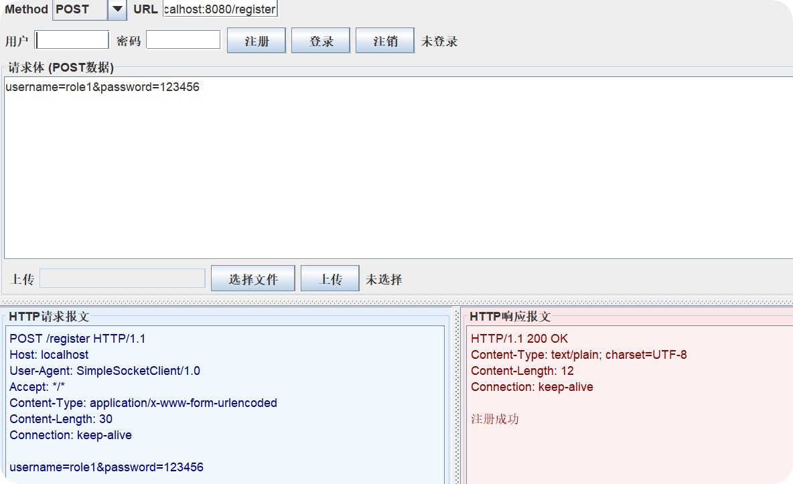

  - 重复注册（409 Conflict）：
    
    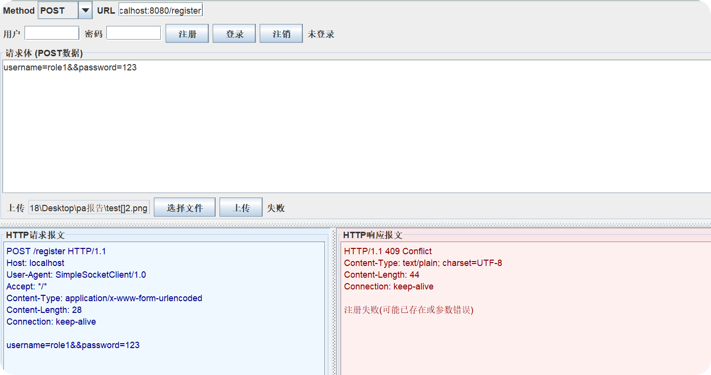
</details>

### 2. 登录
- 说明：同样支持 GUI 快捷按钮与手动 POST。未授权场景返回 401。
<details>
  <summary>展开查看登录演示</summary>

  - 登录请求：
    
    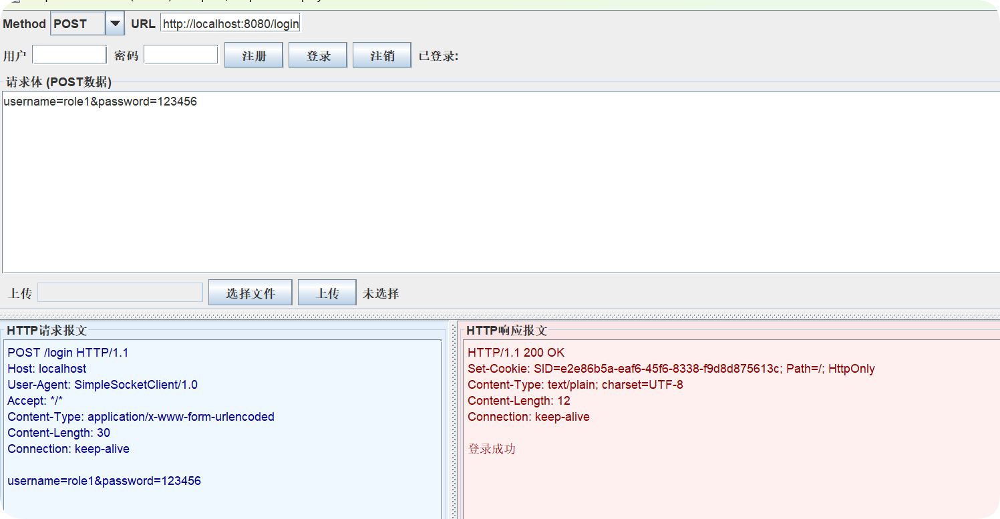

  - 401 未授权：
    
    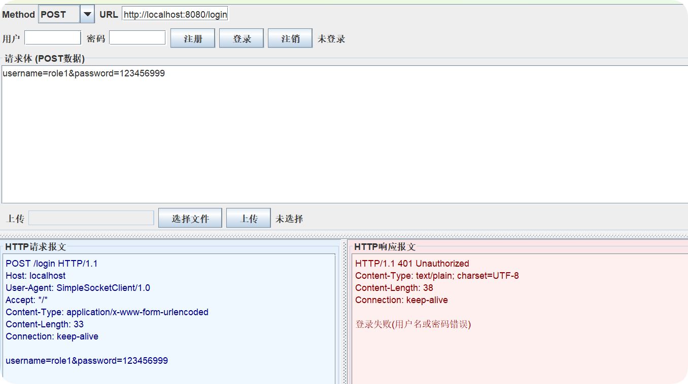
</details>

### 3. 获取服务器资源（GET）
- 说明：首次 `local`（客户端）目录为空，服务端资源包含 `index.html` 等,GET到的资源会存入客户端也即/local文件夹下。
<details>
  <summary>展开查看 GET 与重定向/缓存/错误演示</summary>

  - 200 OK（根路径默认返回 `index.html`）：
    
    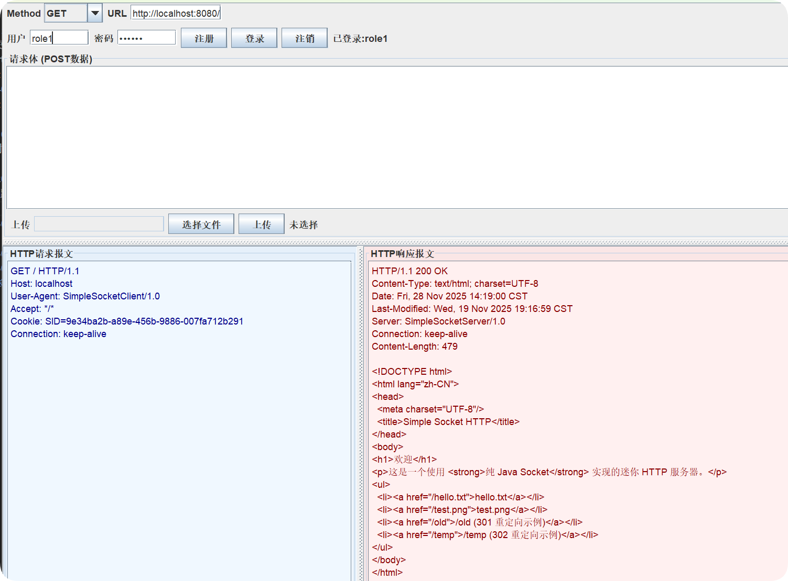

  - 301 Moved Permanently：
    
    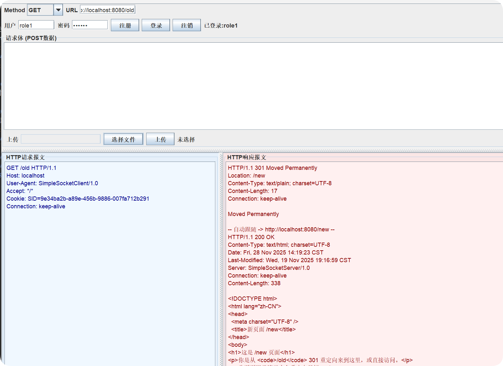

  - 302 Found：
    
    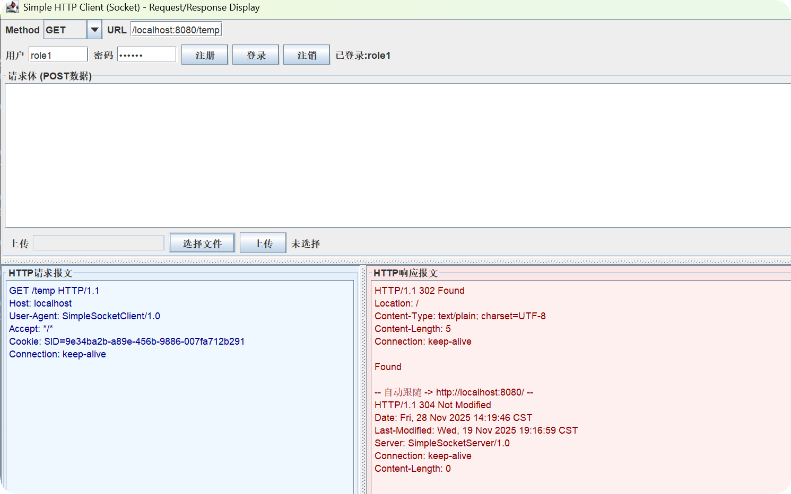

  - 304 Not Modified（缓存验证）：
    
    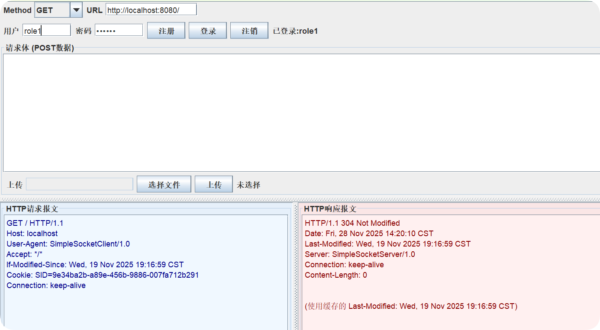

  - 404 Not Found：
    
    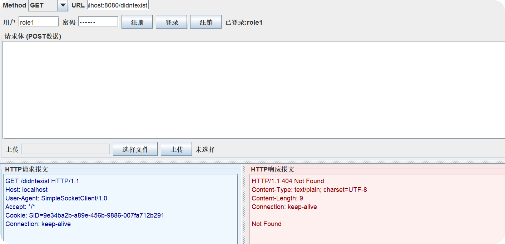

  - 长连接（Keep-Alive）验证：
    
    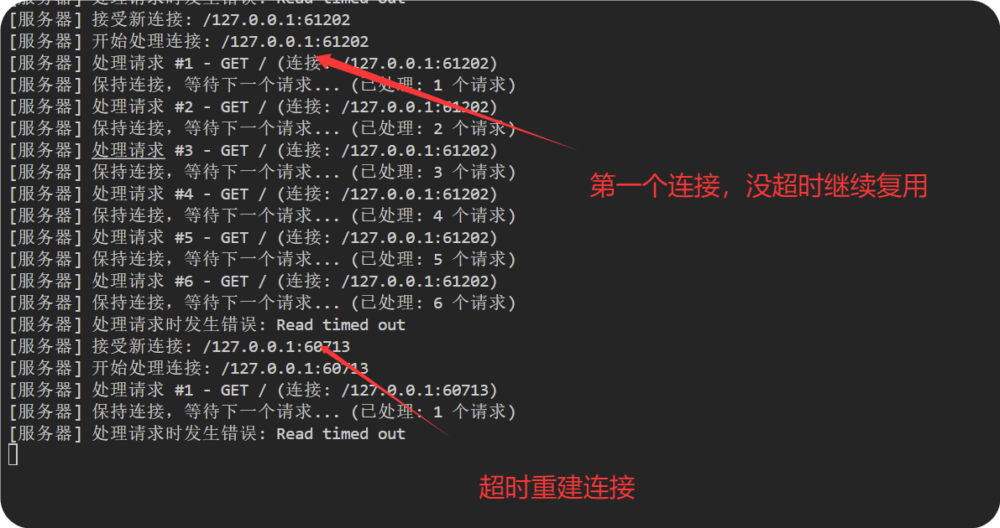

  - 客户端成功获得资源
  
    
</details>

### 4. 不支持的方法（DELETE 示例）
- 说明：使用未实现的 HTTP 方法会返回 405。
<details>
  <summary>展开查看 405 方法不允许</summary>

  - 405 Method Not Allowed：
    
    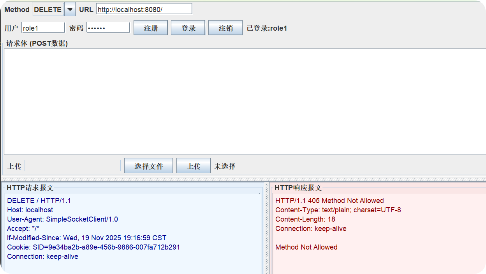
</details>

### 5. 上传资源（422 非法命名）
- 说明：支持文件上传；若命名非法（如包含 `[]`），返回 422。
<details>
  <summary>展开查看上传演示</summary>

  - 上传 `test2.png`：
    
    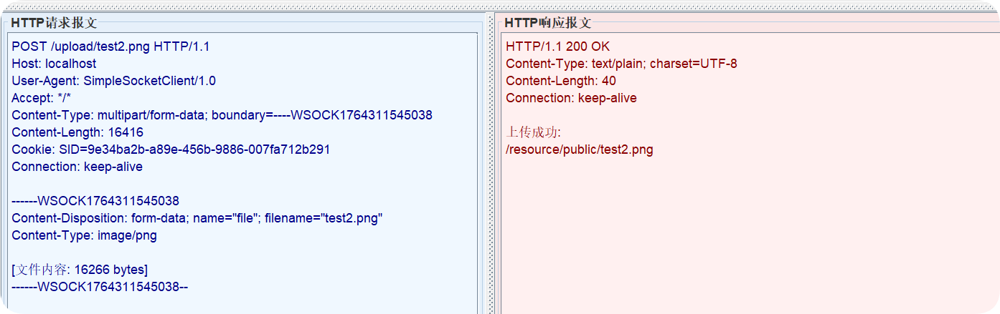

    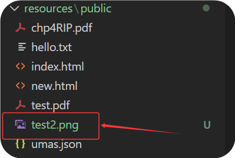

  - 422 非法命名（示例 `test[]2.png`）：
    
    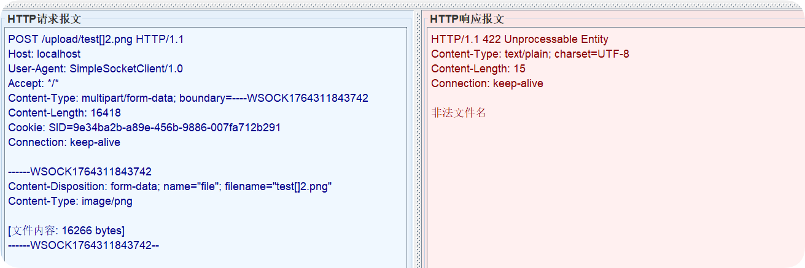
</details>

### 6. 服务器内部错误（500）
- 说明：模拟触发除 0 异常，服务端返回 500。
<details>
  <summary>展开查看 500 错误</summary>

  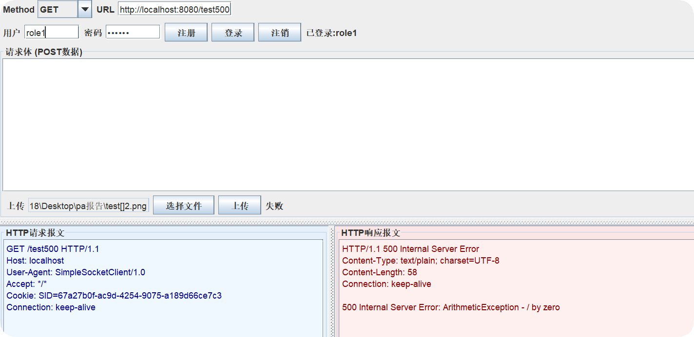
</details>
